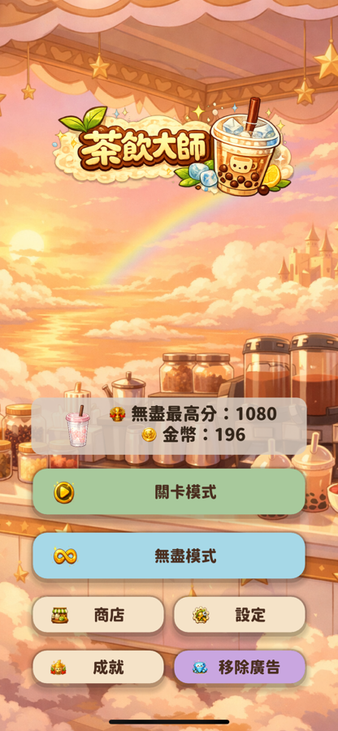
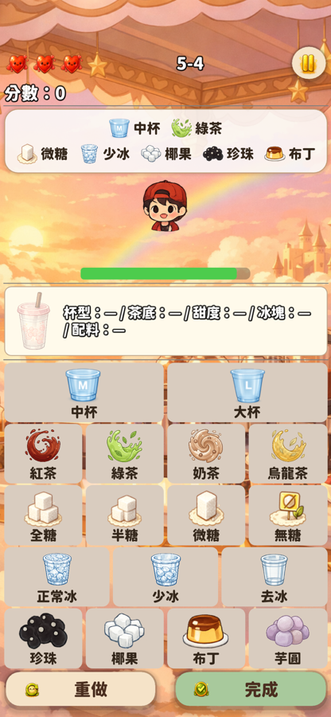
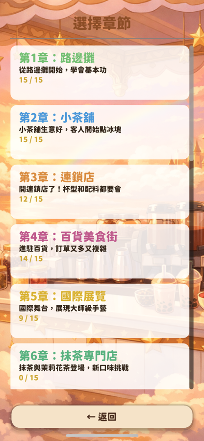

# Bubble Tea Master - App Store Showcase

## Status

Released on the App Store. The complete game project, signing configuration, advertising configuration, and original asset library remain private.

## Game Scope

- Drink-order preparation and ingredient selection
- Timed customers, scoring, combos, and levels
- Achievements, rewards, shop items, and progression
- English, Traditional Chinese, and Japanese localization
- Mobile touch layouts and store-release workflows

## Screenshots

| Main Menu | Order Preparation | Gameplay |
|-----------|-------------------|----------|
|  |  |  |

## Public Showcase

Open `demo.html` to view the English portfolio page and an anonymized English gameplay image.

## Disclosure Boundary

This showcase does not grant access to the complete Godot source, signing credentials, production advertising identifiers, purchase configuration, or full-resolution asset library.

